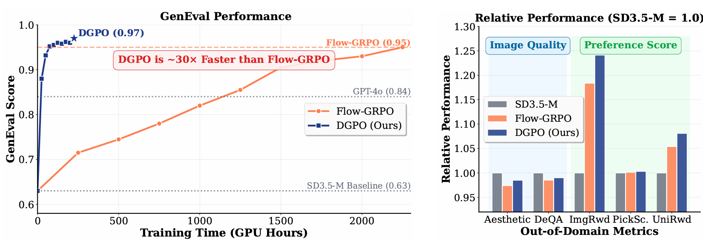

# Reinforcing Diffusion Models by Direct Group Preference Optimization

This is the Official Repository of "Reinforcing Diffusion Models by Direct Group Preference Optimization", by *Yihong Luo, Tianyang Hu, Jing Tang*.

<table align="center">
  <tr>
    <td align="center" width="100%"></td>
  </tr>
  <tr>
    <td colspan="2" align="center">Our proposed <b>DGPO</b> shows a near 30 times faster training compared to Flow-GRPO on improving GenEval score (Left Figure). The notable improvement is achieved while maintaining strong performance on other out-of-domain metrics (Right Figure).</td>
  </tr>
</table>

## Method
The key insight of our work is that the success of methods like GRPO stems from leveraging fine-grained, relative preference information within a group of samples, not from the policy-gradient formulation itself. Existing methods for diffusion models force the use of inefficient stochastic (SDE) samplers to fit the policy-gradient framework, leading to slow training and suboptimal sample quality.

**DGPO** circumvents this problem by optimizing group-level preferences directly, *extending the Direct Preference Optimization (DPO) framework to handle **pairwise groups** instead of pairwise samples*. This allows us to:
- **Use Efficient Samplers:** Employ fast and high-fidelity deterministic ODE samplers for generating training data, leading to better-quality rollouts.
- **Learn Directly from Preferences:** Optimize the model by maximizing the likelihood of group-wise preferences, eliminating the need for a stochastic policy and inefficient random exploration.
- **Train Efficiently:** Avoid training on the entire sampling trajectory, significantly reducing the computational cost of each iteration.

For a group of generated samples, we partition them into a positive set $\mathcal{G}^+$ and a negative set $\mathcal{G}^-$ based on their reward. The model with parameter $\theta$ is trained by maximum likelihood learning of a group-level reward: 

$$
\max_{\theta} E_{(\mathcal{G}^+, \mathcal{G}^-, c) \sim \mathcal{D}} \log p_\theta(\mathcal{G}^+ \succ \mathcal{G}^-|c) = E_{(\mathcal{G}^+, \mathcal{G}^-, c) \sim \mathcal{D}} \log\sigma(R_\theta(\mathcal{G}^+|c) - R_\theta(\mathcal{G}^-|c)).
$$

We refer to the paper for more details.

## Main Results

DGPO consistently outperforms Flow-GRPO on target metrics for Compositional Generation, Text Rendering, and Human Preference Alignment, while also showing strong or superior performance on out-of-domain quality and preference scores.

| Model | GenEval | OCR Acc. | PickScore | Aesthetic | DeQA | ImgRwd | PickScore | UniRwd |
| :--- | :---: | :---: | :---: | :---: | :---: | :---: | :---: | :---: |
| SD3.5-M | 0.63 | 0.59 | 21.72 | 5.39 | 4.07 | 0.87 | 22.34 | 3.33 |
| **_Compositional Image Generation:_** | | | | | | | | |
| Flow-GRPO | 0.95 | --- | --- | 5.25 | 4.01 | 1.03 | 22.37 | 3.51 |
| **DGPO (Ours)** | **0.97** | --- | --- | **5.31** | **4.03** | **1.08** | **22.41** | **3.60** |
| **_Visual Text Rendering:_** | | | | | | | | |
| Flow-GRPO | --- | 0.92 | --- | 5.32 | 4.06 | 0.95 | 22.44 | 3.42 |
| **DGPO (Ours)** | --- | **0.96** | --- | **5.37** | **4.09** | **1.02** | **22.52** | **3.48** |
| **_Human Preference Alignment:_** | | | | | | | | |
| Flow-GRPO | --- | --- | 23.31 | 5.92 | 4.22 | 1.28 | 23.53 | 3.66 |
| **DGPO (Ours)** | --- | --- | **23.89** | **6.08** | **4.40** | **1.32** | **23.91** | **3.74** |

