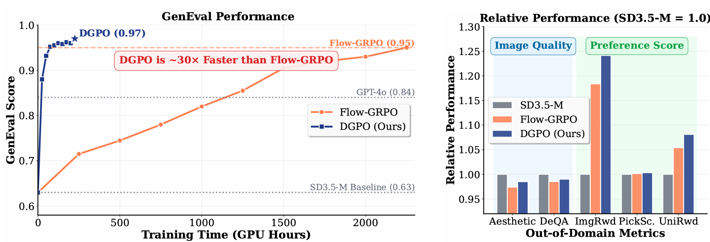

# Reinforcing Diffusion Models by Direct Group Preference Optimization

This is the Official Repository of "[Reinforcing Diffusion Models by Direct Group Preference Optimization](https://arxiv.org/pdf/2510.08425)", by *Yihong Luo, Tianyang Hu, Jing Tang*.

<table align="center">
  <tr>
    <td align="center" width="100%"></td>
  </tr>
  <tr>
    <td colspan="2" align="center">Our proposed <b>DGPO</b> shows a near 30 times faster training compared to Flow-GRPO on improving GenEval score (Left Figure). The notable improvement is achieved while maintaining strong performance on other out-of-domain metrics (Right Figure).</td>
  </tr>
</table>

## 🔥News
- (2026/01) DGPO is accepted to ICLR 2026 🎉!
- (2026/03/07) Code is ready to be released next week.
- (2026/03/14) Training code is released.

## Method
The key insight of our work is that the success of methods like GRPO stems from leveraging fine-grained, relative preference information within a group of samples, not from the policy-gradient formulation itself. Existing methods for diffusion models force the use of inefficient stochastic (SDE) samplers to fit the policy-gradient framework, leading to slow training and suboptimal sample quality.

**DGPO** circumvents this problem by optimizing group-level preferences directly, *extending the Direct Preference Optimization (DPO) framework to handle **pairwise groups** instead of pairwise samples*. This allows us to:
- **Use Efficient Samplers:** Employ fast and high-fidelity deterministic ODE samplers for generating training data, leading to better-quality rollouts.
- **Learn Directly from Preferences:** Optimize the model by maximizing the likelihood of group-wise preferences, eliminating the need for a stochastic policy and inefficient random exploration.
- **Train Efficiently:** Avoid training on the entire sampling trajectory, significantly reducing the computational cost of each iteration.

For a group of generated samples, we partition them into a positive group $\mathcal{G}^+$ and a negative group $\mathcal{G}^-$ based on their reward. The model with parameter $\theta$ is trained by maximum likelihood learning of a group-level reward: 

$$
\max_{\theta} E_{(\mathcal{G}^+, \mathcal{G}^-, c) \sim \mathcal{D}} \log p_\theta(\mathcal{G}^+ \succ \mathcal{G}^-|c) = E_{(\mathcal{G}^+, \mathcal{G}^-, c) \sim \mathcal{D}} \log\sigma(R_\theta(\mathcal{G}^+|c) - R_\theta(\mathcal{G}^-|c)).
$$

We refer to our paper for more details.

## Main Results

DGPO consistently outperforms Flow-GRPO on target metrics for Compositional Generation, Text Rendering, and Human Preference Alignment, while also showing strong or superior performance on out-of-domain quality and preference scores.

| Model | GenEval | OCR Acc. | PickScore | Aesthetic | DeQA | ImgRwd | PickScore | UniRwd |
| :--- | :---: | :---: | :---: | :---: | :---: | :---: | :---: | :---: |
| SD3.5-M | 0.63 | 0.59 | 21.72 | 5.39 | 4.07 | 0.87 | 22.34 | 3.33 |
| **_Compositional Image Generation:_** | | | | | | | | |
| Flow-GRPO | 0.95 | --- | --- | 5.25 | 4.01 | 1.03 | 22.37 | 3.51 |
| **DGPO (Ours)** | **0.97** | --- | --- | **5.31** | **4.03** | **1.08** | **22.41** | **3.60** |
| **_Visual Text Rendering:_** | | | | | | | | |
| Flow-GRPO | --- | 0.92 | --- | 5.32 | 4.06 | 0.95 | 22.44 | 3.42 |
| **DGPO (Ours)** | --- | **0.96** | --- | **5.37** | **4.09** | **1.02** | **22.52** | **3.48** |
| **_Human Preference Alignment:_** | | | | | | | | |
| Flow-GRPO | --- | --- | 23.31 | 5.92 | 4.22 | 1.28 | 23.53 | 3.66 |
| **DGPO (Ours)** | --- | --- | **23.89** | **6.08** | **4.40** | **1.32** | **23.91** | **3.74** |


## 🚀 Quick Started

Clone this repository and install packages.
```bash
git clone https://github.com/Luo-Yihong/DGPO.git
cd DGPO
conda create -n flow_grpo python=3.10.16
pip install -e .
```
### Reward Preparation
```bash
# GenEval
pip install -U openmim
mim install mmengine
git clone https://github.com/open-mmlab/mmcv.git
cd mmcv; git checkout 1.x
MMCV_WITH_OPS=1 FORCE_CUDA=1 pip install -e . -v
cd ..

git clone https://github.com/open-mmlab/mmdetection.git
cd mmdetection; git checkout 2.x
pip install -e . -v
cd ..

# OCR
pip install paddlepaddle-gpu==2.6.2
pip install paddleocr==2.9.1
pip install python-Levenshtein
```


### Start Training
We recommend using the "CFG during training, no CFG during inference" mode by default:
```bash
bash scripts/single_node/sd3_dgpo_ocr.sh
```
We also support a fully CFG-free mode, in which case we recommend using a reference model with CFG for the DGPO loss computation or using the dynamic reference model proposed in [TDM-R1](https://arxiv.org/abs/2603.07700):
```bash
# ref w/ cfg:
bash scripts/single_node/sd3_dgpo_ocr_wocfg.sh

# dynamic ref:
bash scripts/single_node/sd3_dgpo_ocr_wocfg_emaref.sh
```

## Acknowledgement
Motivated by a thoughtful comment during the review process, we have added PPO-style clipping in training, where we observed improved training stability. Thanks to the effort by the anonymous reviewers. Our codebase is largely built upon [Flow-GRPO](https://github.com/yifan123/flow_grpo). We simplify the environment setup for GenEval following [DiffusionNFT](https://github.com/NVlabs/DiffusionNFT). We thank the authors for their efforts to the open-source codebase.


## Contact

Please contact Yihong Luo (yluocg@connect.ust.hk) if you have any questions about this work.

## Bibtex

```
@misc{luo2025dgpo,
      title={Reinforcing Diffusion Models by Direct Group Preference Optimization}, 
      author={Yihong Luo and Tianyang Hu and Jing Tang},
      year={2025},
      eprint={2510.08425},
      archivePrefix={arXiv},
      primaryClass={cs.LG},
      url={https://arxiv.org/abs/2510.08425}, 
}
```

